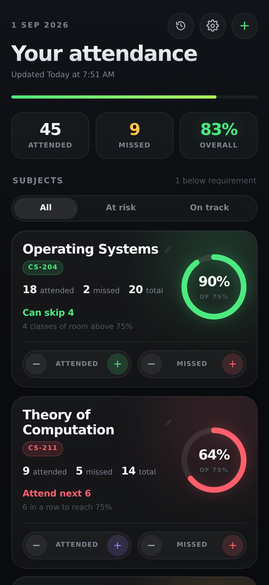
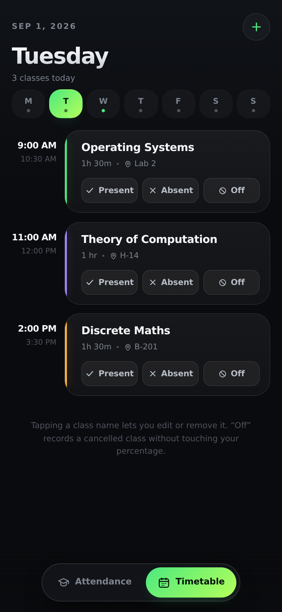
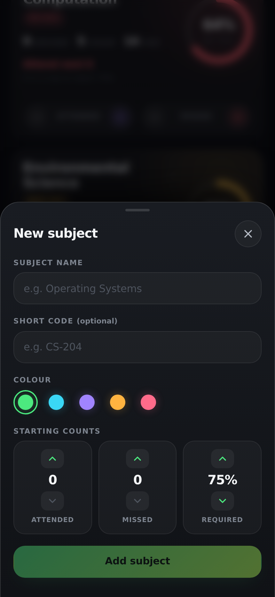
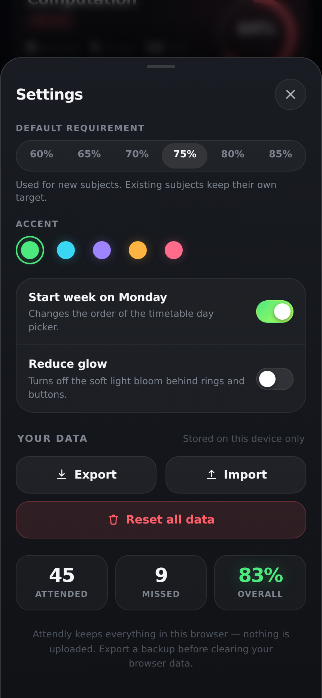

# Attendly

A timetable and attendance tracker for students. Log every class, see at a glance
how many you can still afford to skip, and mark attendance straight from your
weekly schedule.

Two apps, one core: a mobile-format **web app** that runs on any device and
installs as a PWA, and a **React Native app** (Expo) for iOS and Android. Both
share the same attendance maths, reducer and palette, so they behave identically.
Everything is stored on the device; nothing is uploaded anywhere.

| Attendance | Timetable | New subject | Settings |
| --- | --- | --- | --- |
|  |  |  |  |

## What it does

**Attendance**
- One card per subject with a live percentage ring, colour-coded by how you're doing.
- Tells you the thing you actually want to know: **“Can skip 4”** when you're
  comfortable, **“Attend next 6”** when you've slipped below your requirement.
- Per-subject requirement (60–85%), so a subject with an 80% rule is judged at 80%.
- Quick +/− counters on every card, plus overall totals across all subjects.
- Filter to just the subjects at risk once you have a few.

**Timetable**
- Weekly schedule with a day picker; days that have classes are dotted.
- Mark each class **Present**, **Absent**, or **Off** (cancelled) in one tap — marks
  feed straight into your attendance numbers, and *Off* deliberately does not
  move your percentage.
- Marks are recorded per calendar date, so a Monday class marked on Monday is
  independent of next Monday's. Future days are read-only until they arrive.

**Everything else**
- History of every change, with undo on anything that moved your numbers.
- Five accent themes, Monday/Sunday week start, and a reduced-glow mode.
- Export/import your data as JSON, and a full reset.
- Works offline after the first load.

## The maths

Both headline numbers come from `src/lib/attendance.ts`:

- **Can skip** — the largest `k` where `attended / (total + k) ≥ requirement`.
- **Attend next** — the smallest `k` where `(attended + k) / (total + k) ≥ requirement`.

`tests/attendance.test.ts` checks these against each other exhaustively over a
grid of attended/missed pairs: skipping exactly `canSkip` classes must stay at or
above the line, and one more must fall below it.

## Running it

```bash
npm install
npm run dev        # development server
npm run build      # type-check and build to dist/
npm run preview    # serve the production build
```

## Checks

```bash
npm run typecheck    # tsc, web app and shared core
npm test             # attendance maths unit tests
npm run smoke        # end-to-end browser test (needs `npm run preview` running)
npm run shots        # regenerate screenshots into shots/
npm run pages        # capture every screen into shots/pages/
npm run mobile:check # drives the Expo app's web build in a browser
```

`mobile:check` exists because the React Native UI can't be opened here directly:
`cd mobile && npx expo export --platform web --output-dir dist-web`, serve that
folder on port 4190, and the script drives the real components through
react-native-web — creating a subject, marking a class, checking the numbers.
`cd mobile && npx tsc --noEmit` type-checks the native app.

`smoke` and `shots` drive Chromium through Playwright against the preview server
at `http://localhost:4173`. Set `BASE_URL` or `CHROMIUM_PATH` to point them
elsewhere.

## Deploying the web app

`.github/workflows/deploy.yml` builds the app and publishes it to GitHub Pages
on every push. Turn it on once, under **Settings ▸ Pages ▸ Build and deployment
▸ Source = GitHub Actions**. After that each push redeploys, and the site lands
at `https://<user>.github.io/<repo>/`.

The workflow runs `typecheck`, `test` and `build` first, so a broken commit
fails the job instead of replacing a working site.

Pages serves the app from a subdirectory rather than a domain root, which is
where relative-path bugs usually surface. `vite.config.ts` sets `base: './'` and
every asset, the manifest and the service worker are referenced relatively;
`npm run subpath:check` serves `dist/` under a subpath and confirms nothing
404s.

## Single-file build

```bash
npm run build:single -- attendly.html
```

Inlines the CSS and JS into one self-contained HTML file you can host anywhere
or open directly. It builds with `VITE_SW=off`, since a lone HTML file has no
`sw.js` beside it to register. `scripts/verify-artifact.mjs` checks that the
result runs on its own with no console errors.

Note that the browser download in **Settings → Export** relies on a blob link,
which some sandboxed hosts block; it works when the app is served normally.

## The mobile app (Expo)

```bash
cd mobile
npm install
npx expo start
```

Scan the QR code with **Expo Go** (iOS: the Camera app; Android: Expo Go's
scanner). Your phone and computer need to be on the same Wi-Fi — add `--tunnel`
if they aren't. From the repo root, `npm run mobile` does the same thing.

It's a real React Native app, not a web view: native scrolling, modal sheets,
`expo-haptics` feedback, `react-native-svg` gauges, and AsyncStorage persistence.

## Getting the mobile app onto TestFlight

Everything that can be prepared without your Apple account is in the repo:
`mobile/eas.json` has the build profiles, `app.json` carries the bundle id
`com.attendly.app` and declares no non-exempt encryption (so App Store Connect
stops asking on every upload), and the icon is a 1024x1024 PNG with no alpha
channel, which the App Store rejects.

What only you can do:

1. **Join the Apple Developer Program** — $99/year, and there is no way around
   it for TestFlight.
2. **Create the app in App Store Connect** with the bundle id
   `com.attendly.app`.
3. **Sign in and build.** No Mac needed; EAS builds in the cloud:
   ```bash
   cd mobile
   npx eas-cli login          # a free Expo account
   npx eas-cli build:configure
   npx eas-cli build --platform ios --profile production
   ```
   EAS offers to create and hold the signing certificates for you. Say yes
   unless you already manage them.
4. **Upload it:**
   ```bash
   npx eas-cli submit --platform ios --latest
   ```
5. **In App Store Connect ▸ TestFlight**, wait for processing (usually 5-15
   minutes), then add testers. Internal testers — up to 100 people on your own
   team — need no review. External testers need Beta App Review, which is
   lighter than App Store review but not instant.

For later builds, `production` has `autoIncrement`, so the build number rises
on its own; bump `version` in `app.json` when you ship a new release.

An Android APK, if you want one to sideload, needs no Apple account at all:
`npx eas-cli build --platform android --profile preview`.

## Layout

```
shared/         platform-agnostic core, used by BOTH apps
  types.ts        the data model
  attendance.ts   percentages, can-skip / must-attend
  date.ts         formatting, week ordering, time maths
  week.ts         which calendar date a weekday falls on
  accents.ts      the palette
  reducer.ts      every state transition, plus hydrate()

src/            the web app (Vite + React)
  store/          localStorage persistence over the shared reducer
  components/     Ring, Sheet, Toast, Stepper, Switch, SubjectCard, icons
  screens/        Attendance, Timetable, and the four sheets
  styles/         design tokens, base layer, component layer

mobile/         the Expo app (React Native)
  src/theme.ts    the same tokens expressed as RN styles
  src/store/      AsyncStorage persistence over the shared reducer
  src/components/ the same components, built from RN primitives
  src/screens/    the same screens and sheets
```

State lives in one reducer (`shared/reducer.ts`); each platform only supplies
storage. Every attendance-changing action records the delta it applied, which is
what makes undo exact rather than approximate.
